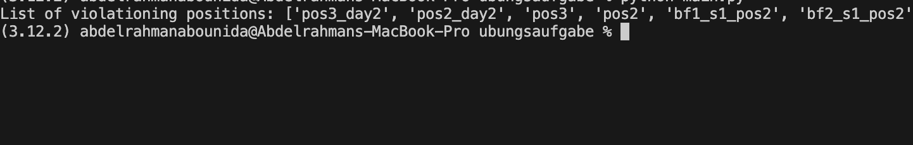
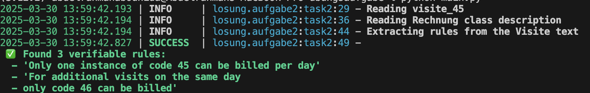

# Losung

### Folder Structure

    ├── files                    # Task Description aka visite.txt , .. >> I will push it if suitable
    ├── losung                    # Main Solution implementation
    ├── rechnungen                # rechnugen Base classes
    └── main.py                   # to check the solution results

### Results

- Task1
<p align="center" width="100%">
  
</p>

- Task2
<p align="center" width="100%">
  
</p>

### ⚠️ Warning

Before running losung2, first you **must** create `.env` file using `.env.example` template and also add this file `files/45_Visite.txt`

### Setup

- using PDM

```bash
pdm venv create 3.11
pdm install
```

- using pip

```bash
python -m venv venv
source venv/bin/activate # for unix os
pip install -r requirements.txt
```

### Running Losungen

```bash
python main.py
```
